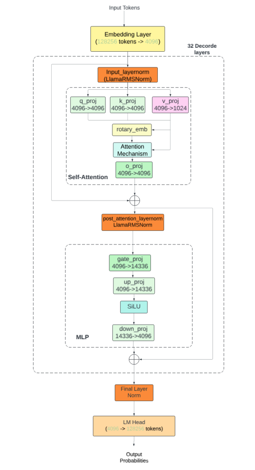

# llm-fine-tuning
LLM Fine Tuning collection

## Deep dive to llama3.1
[Understand How Llama3.1 Works — A Deep Dive Into the Model Flow](https://medium.com/@yuxiaojian/understand-how-llama3-1-works-a-deep-dive-into-the-model-flow-b149aba04bed)

  

## Fine-tuning with Llama3.1
1. Medium story [Fine-Tuning Ollama Models with Unsloth](https://medium.com/@yuxiaojian/fine-tuning-ollama-models-with-unsloth-a504ff9e8002)
    * [unsloth-ft-llama31-8b-instruct.py](llama31/unsloth/unsloth-ft-llama31-8b-instruct.py)
    * [unsloth-ft-llama31-8b-instruct-Modelfile](llama31/unsloth/unsloth-ft-llama31-8b-instruct-Modelfile)
2. Medium story [Prepare Your Dataset for Fine-Tuning Llama 3.1](https://medium.com/@yuxiaojian/prepare-your-dataset-for-fine-tuning-llama-3-1-46fd3c78f6fd)
3. Medium story [Fine-Tuning Llama3.1 and Deploy to Ollama](https://medium.com/@yuxiaojian/fine-tuning-llama3-1-and-deploy-to-ollama-f500a6579090)
    * [llama3.1-instruct-8b-bnb-4bit-lora-chat-ft.ipynb](llama31/llama3.1-instruct-8b-bnb-4bit-lora-chat-ft.ipynb)
